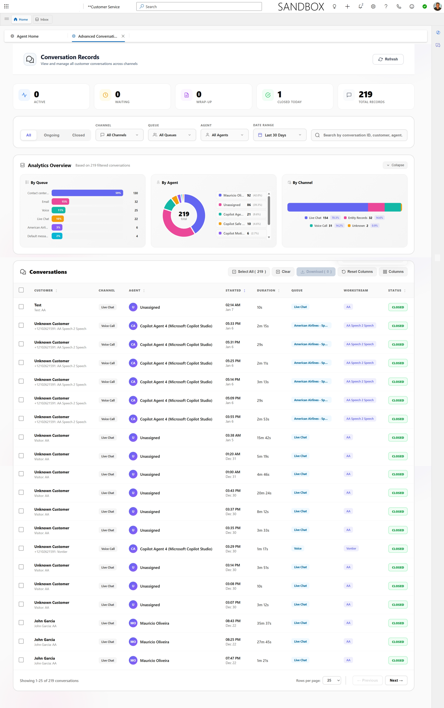

# Advanced Conversations for Dynamics 365

A comprehensive web-based interface for managing, analyzing, and exporting customer service conversations from Microsoft Dynamics 365 Customer Service / Omnichannel for Customer Service.

## Screenshot

*The Advanced Conversations interface showing conversation records, analytics, and management features*

## Overview

Advanced Conversations is a powerful HTML application that integrates with Dynamics 365 to provide enhanced conversation management capabilities. It offers a modern, intuitive interface for customer service teams to view, filter, assign, and analyze customer interactions across multiple communication channels.

## Key Features

### 📊 Conversation Management
- **View All Conversations**: Comprehensive list view of all customer conversations from Dynamics 365
- **Multi-Channel Support**: Handle conversations from various channels (Chat, SMS, Voice, Social Media, etc.)
- **Real-time Updates**: Refresh capability to fetch the latest conversation data
- **Advanced Filtering**: Filter conversations by status, date range, channel, queue, sentiment, and more
- **Bulk Operations**: Select and manage multiple conversations simultaneously

### 🔍 Search & Filter
- **Conversation ID Search**: Quick lookup by conversation identifier
- **Status Filtering**: Filter by Open, Active, Wrap-up, Waiting, Closed states
- **Date Range Filters**: Predefined ranges (Today, Yesterday, Last 7 Days, etc.) or custom date selection
- **Multi-Select Filters**: Filter by multiple channels, queues, or agents at once
- **Sentiment Analysis**: Filter conversations based on customer sentiment scores

### 👥 Agent Assignment
- **Assign Conversations**: Bulk assign conversations to available agents
- **Agent Availability**: View available agents from configured queues
- **Queue Management**: Organize conversations by service queues

### 📥 Export & Download
- **Multiple Export Formats**:
  - JSON: Structured data export for integration
  - Single Text File: All transcripts in one consolidated file
  - Multiple Text Files: Individual transcript files in a ZIP archive
- **Transcript Download**: Export full conversation transcripts including:
  - Messages and responses
  - Timestamps
  - Participant information
  - Channel metadata

### 📈 Analytics Dashboard
- **Visual Analytics**: Interactive charts and graphs powered by D3.js
- **Distribution Analysis**: 
  - Conversation distribution by channel
  - Status breakdown
  - Agent workload visualization
- **Statistical Insights**: Key metrics and performance indicators
- **Donut Charts**: Visual representation of conversation distribution
- **Bar Charts**: Comparative analysis of conversations across different dimensions

### ⚙️ Customization
- **Column Management**: 
  - Show/hide table columns
  - Drag-and-drop column reordering
  - Save column preferences
- **Sorting**: Sort conversations by any column
- **Pagination**: Configurable page size (25, 50, 100, 250 records)
- **Saved Preferences**: Persistent user settings for filters and display options

### 📋 Conversation Details
View comprehensive information for each conversation:
- Customer name and contact details
- Conversation title and subject
- Channel type (icon-based identification)
- Queue assignment
- Assigned agent
- Status and sentiment
- Duration and timestamps
- Associated work item details

### 🔐 Bulk Actions
- **Close Conversations**: Bulk close completed conversations with owner assignment
- **Status Updates**: Update conversation states in bulk
- **Select All**: Quick selection of filtered conversations

## Technical Details

### Integration
- Built on **Dynamics 365 Web API** using the Xrm.WebApi framework
- Queries the following Dynamics 365 entities:
  - `msdyn_ocliveworkitem` - Live work items (conversations)
  - `msdyn_transcript` - Conversation transcripts
  - `msdyn_conversationmessageblock` - Message blocks
  - `msdyn_conversationaction` - Conversation actions
  - Agent and queue entities

### Technology Stack
- **HTML5** with modern JavaScript (ES6+)
- **D3.js** for data visualization
- **Fluent UI System Icons** for consistent Microsoft design language
- **Responsive Design** for desktop and mobile views

### Entity Schema
Works with Microsoft Dynamics 365 Customer Service entities including:
- Customer sentiment tracking (`msdyn_customersentimentlabel`, `msdyn_customersentimentscore`)
- Omnichannel queue management (`msdyn_cdsqueueid`, `msdyn_isomnichannelqueue`)
- Live work stream tracking (`msdyn_liveworkstreamid`)
- Multi-channel support (`msdyn_channel`, `msdyn_streamsource`)

## Use Cases

### Customer Service Teams
- Monitor active and historical customer conversations
- Identify conversations requiring attention
- Analyze customer sentiment trends
- Export conversation data for compliance or training

### Team Managers
- View team workload distribution
- Assign conversations to available agents
- Track conversation volumes by channel
- Monitor team performance through analytics

### Quality Assurance
- Export conversation transcripts for review
- Filter conversations by sentiment for quality checks
- Analyze conversation patterns and trends

### Compliance & Reporting
- Export conversation records in multiple formats
- Generate reports on conversation volumes and outcomes
- Maintain audit trails of customer interactions

## Getting Started

1. **Deploy to Dynamics 365**: 
   - Upload the HTML file as a Web Resource in your Dynamics 365 environment
   - Alternatively, host on a web server accessible to your Dynamics 365 instance
   - Ensure the page is embedded in an iframe context where Xrm context is available
2. **Configure Access**: Ensure users have appropriate security roles for conversation entities
3. **Open the Application**: Access through Dynamics 365 or as a standalone page
4. **Set Permissions**: Grant read/write access to relevant Omnichannel entities (msdyn_ocliveworkitem, msdyn_transcript, etc.)

## Requirements

- Microsoft Dynamics 365 Customer Service with Omnichannel for Customer Service
- Appropriate security roles for accessing conversation entities
- Modern web browser (Chrome, Edge, Firefox, Safari)
- Internet connection for CDN resources (D3.js, Fluent UI icons)

## Features at a Glance

✅ Multi-channel conversation view  
✅ Advanced filtering and search  
✅ Bulk conversation management  
✅ Agent assignment workflow  
✅ Multiple export formats  
✅ Interactive analytics dashboard  
✅ Customizable table columns  
✅ Sentiment analysis integration  
✅ Real-time data refresh  
✅ Responsive design  
✅ Persistent user preferences  

## Support

For issues, questions, or feature requests, please refer to the repository's issue tracker.

---

**Note**: This application requires Microsoft Dynamics 365 Customer Service with Omnichannel for Customer Service to function properly. It integrates directly with the Dynamics 365 Web API using the Xrm context.
